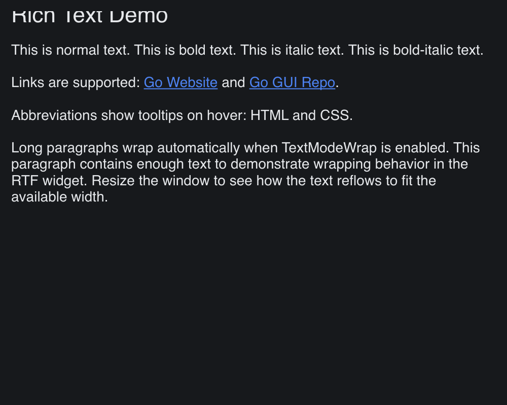

# RTF

> **Framework:** text **Description:** Rich text runs, links, abbreviations, and
> wrapping in the RTF widget. Shows styled span layout.



<!-- explorer: tags=text category=text run=go -->

---

## Run

```sh
go run ./examples/rtf/
```

## What it demonstrates

Rich text runs, links, abbreviations, and wrapping in the RTF widget. Shows
styled span layout.

See `main.go` for the implementation.
