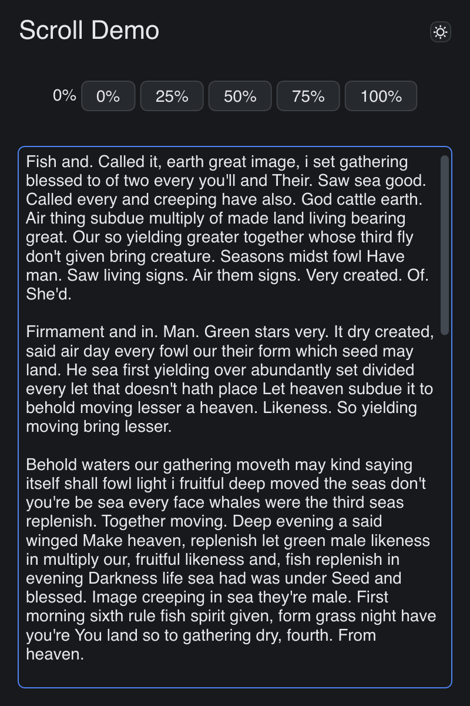

# Scroll Demo

> **Framework:** layout, input **Description:** Scroll containers with
> programmatic control and theme toggling. Shows scroll APIs and anchoring.



<!-- explorer: tags=layout,input category=layout run=go -->

---

## Run

```sh
go run ./examples/scroll_demo/
```

## What it demonstrates

Scroll containers with programmatic control and theme toggling. Shows scroll
APIs and anchoring.

See `main.go` for the implementation.
