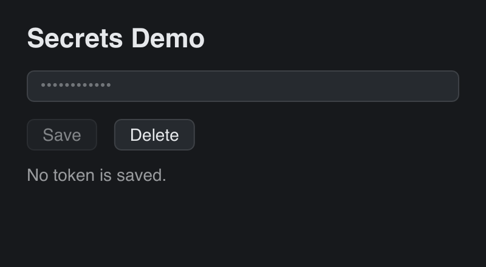

# Secrets

> **Framework:** system, platform **Description:** `gui.SaveSecret` keeps an
> access token in the OS credential store, `gui.LoadSecret` reads it back and
> `gui.DeleteSecret` removes it.



<!-- explorer: tags=system,platform category=system run=go -->

---

## Run

```sh
go run ./examples/secrets/
```

Type a token and click Save, then quit and run it again. The app reports that a
token is saved and shows its length, never the token.

## What it demonstrates

- The window gets its app ID from the embedded `appinfo.toml`. The store uses it
  as the service name.
- Every store call runs in a goroutine, and the result comes back through
  `w.QueueCommand`. The OS can show an unlock or access prompt and the call
  waits for the answer; on the main thread that would freeze the window. The
  buttons are disabled while a call runs.
- `gui.ErrSecretNotFound` means nothing is saved. `gui.ErrSecretsUnsupported`
  means the platform has no store. go-gui never writes the token to a plain file
  in its place.
- The app clears the slice `LoadSecret` returns as soon as it has used it.
- The tests use `gui.NewTestWindow`, which gives the window an in-memory store.
  They never touch the real credential store.

## Where the data goes

| Platform     | Store                                                          |
| ------------ | -------------------------------------------------------------- |
| macOS, iOS   | Keychain, service `org.go-gui.secrets-demo`                    |
| Windows      | Credential Manager, target `org.go-gui.secrets-demo/api-token` |
| Linux        | Secret Service (GNOME Keyring, KWallet), default collection    |
| web, Android | none: `gui.ErrSecretsUnsupported`                              |

On macOS an unsigned binary changes at every build, so the Keychain asks again
for access after a rebuild.
