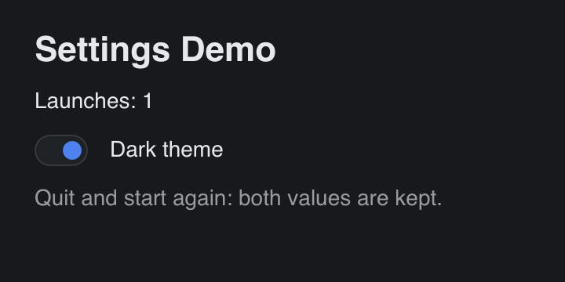

# Settings

> **Framework:** system, platform **Description:** A typed settings struct that
> `gui.LoadSettings` reads at start-up and `gui.SaveSettings` writes on each
> change.



<!-- explorer: tags=system,platform category=system run=go -->

---

## Run

```sh
go run ./examples/settings/
```

Turn the switch off, quit and run it again. The switch stays off, and the launch
count goes up by one.

## What it demonstrates

- `Settings` is a plain Go struct. It is the schema: `encoding/json` encodes it.
- The window gets its app ID from the embedded `appinfo.toml`. The store keys
  the saved data by that ID, so every window of the app reads the same settings.
- `OnInit` fills the defaults and then calls `gui.LoadSettings`. A field that
  the saved data does not have keeps its default. A first run finds nothing and
  returns no error.
- Each change calls `gui.SaveSettings`, which replaces the whole blob. On
  desktop the file is replaced atomically, so a crash cannot leave a partial
  file.
- The tests use `gui.NewTestWindow`, which gives the window an in-memory store.
  They never touch the real settings file.

## Where the data goes

| Platform              | Store                                                       |
| --------------------- | ----------------------------------------------------------- |
| macOS, Windows, Linux | `os.UserConfigDir()/org.go-gui.settings-demo/settings.json` |
| iOS                   | the same path, inside the app sandbox                       |
| Android               | the app's files directory (the host calls `SetFilesDir`)    |
| web                   | `localStorage`, key `gogui.settings.<app ID>`               |

On Linux `os.UserConfigDir()` is `$XDG_CONFIG_HOME`, or `~/.config` when that is
not set. The file is state that the app writes for itself, not a config file to
edit by hand: the next save overwrites a hand edit.
