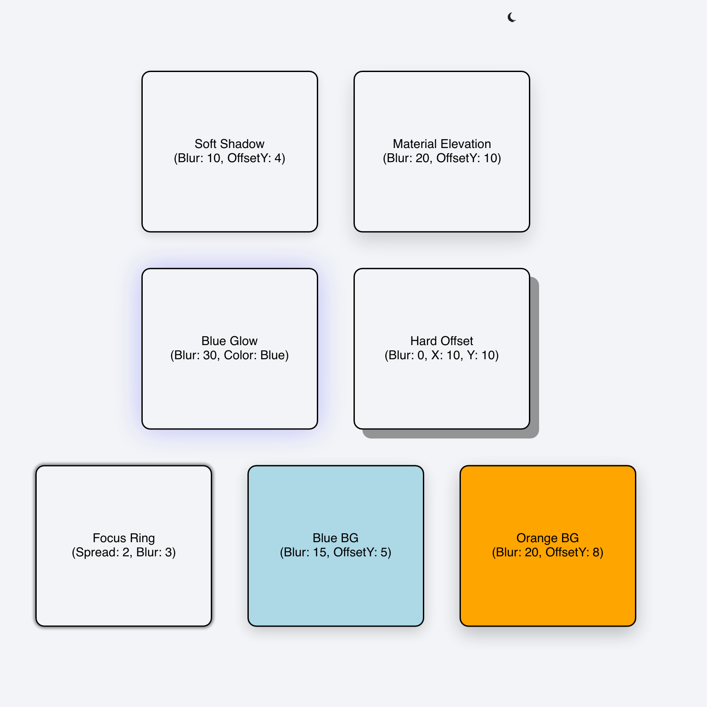

# Shadow Demo

> **Framework:** graphics, theme **Description:** Shadow and glow configurations
> with theme toggling. Compares shadow radius and color.



<!-- explorer: tags=graphics,theme category=graphics run=go -->

---

## Run

```sh
go run ./examples/shadow_demo/
```

## What it demonstrates

Shadow and glow configurations with theme toggling. Compares shadow radius and
color.

See `main.go` for the implementation.
