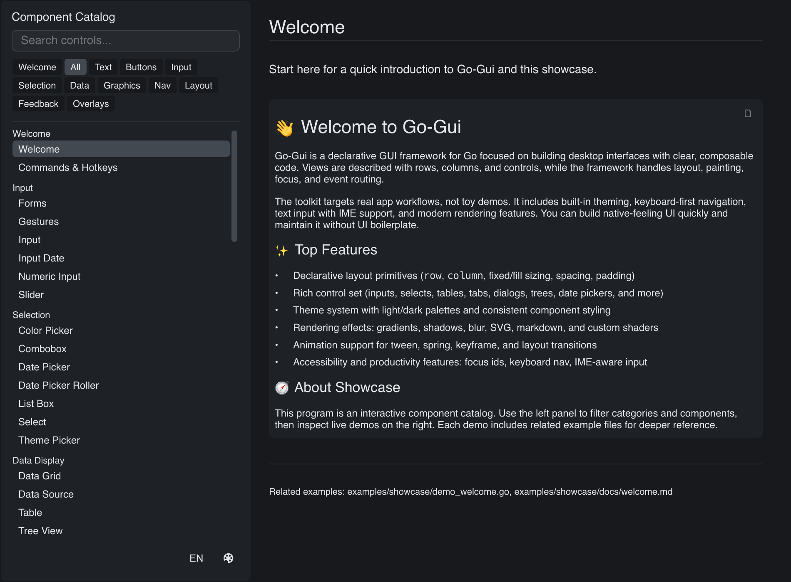

# Showcase

> **Framework:** system, layout, theme **Description:** Full widget gallery with
> a dev-mode inspector. Catalog of every control and visual style.



<!-- explorer: tags=system,layout,theme category=system run=go -->

---

## Run

```sh
go run ./examples/showcase/
```

## What it demonstrates

Full widget gallery with a dev-mode inspector. Catalog of every control and
visual style.

See `main.go` for the implementation.
