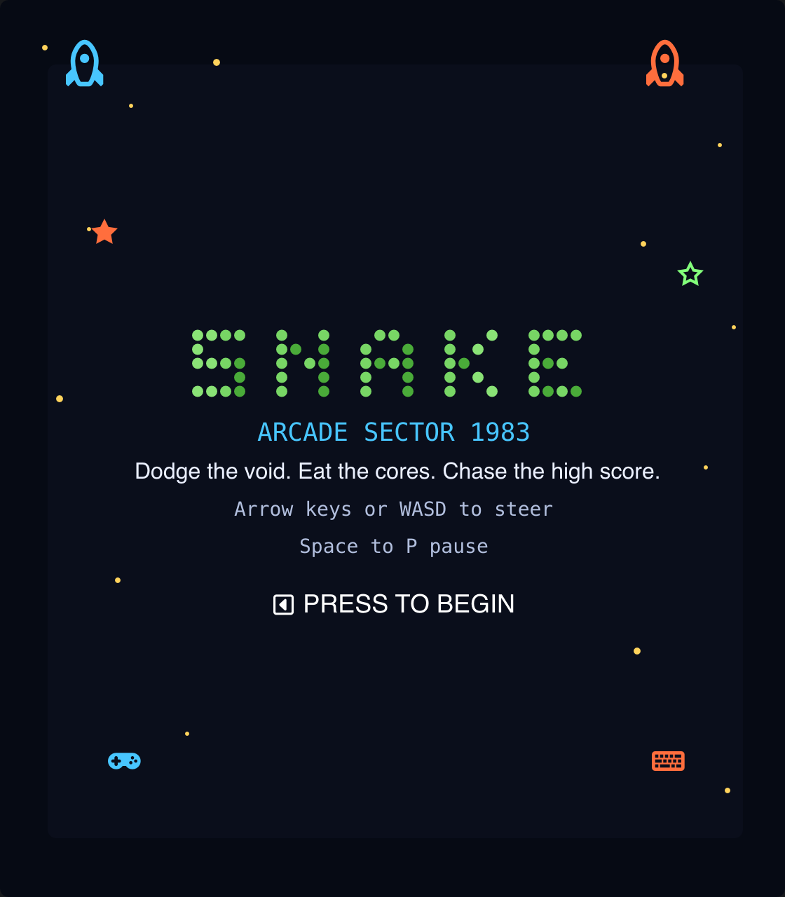

# Snake

> **Framework:** games **Description:** Classic snake game with input, state,
> and animations. Arrow keys steer the snake to eat food.



<!-- explorer: tags=games category=games run=go -->

---

## Run

```sh
go run ./examples/snake/
```

## What it demonstrates

Classic snake game with input, state, and animations. Arrow keys steer the snake
to eat food.

See `main.go` for the implementation.
