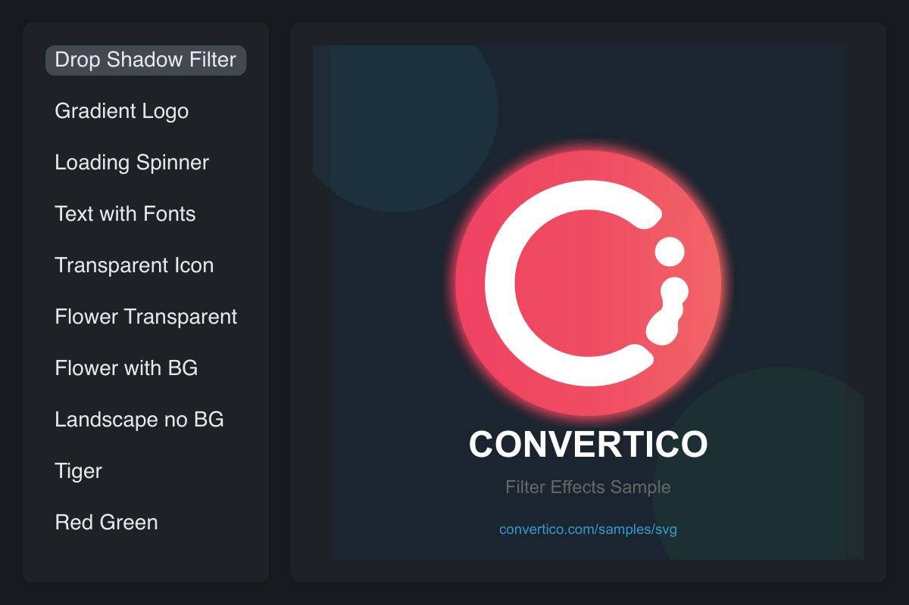

# SVG

> **Framework:** svg **Description:** Browser for embedded SVG assets in a
> split-view. Shows parsing and rendering of vector assets.



<!-- explorer: tags=svg category=svg run=go -->

---

## Run

```sh
go run ./examples/svg/
```

## What it demonstrates

Browser for embedded SVG assets in a split-view. Shows parsing and rendering of
vector assets.

See `main.go` for the implementation.
