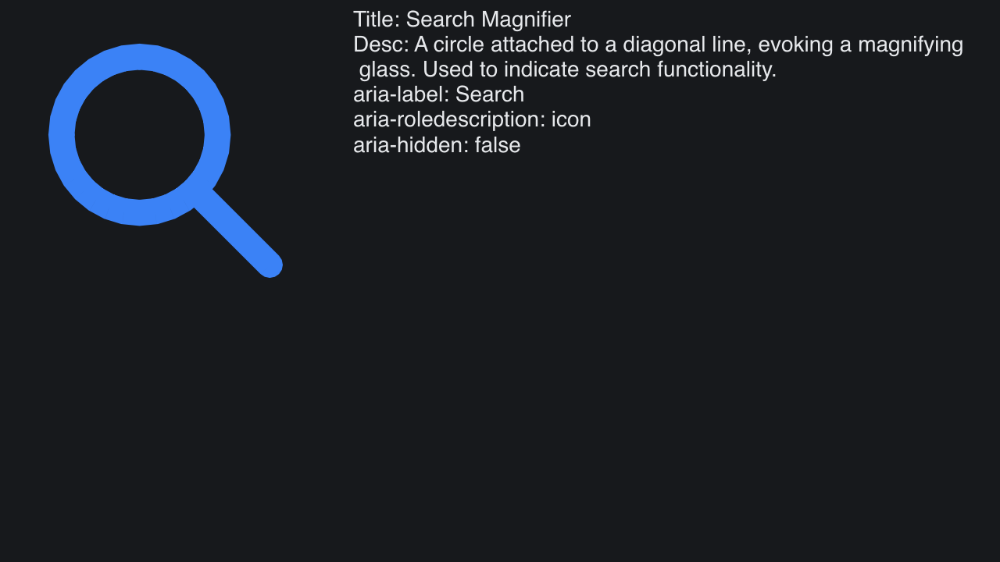

# SVG A11y

> **Framework:** svg **Description:** SVG accessibility metadata: title, desc,
> and aria attributes surfaced on SvgParsed.A11y.



<!-- explorer: tags=svg category=svg run=go -->

---

# svg_a11y

Demonstrates accessibility metadata parsing on SVG documents. The viewer renders
an icon and prints its parsed `<title>`, `<desc>`, and `aria-*` attributes
side-by-side.

## Run

```
go run ./examples/svg_a11y
```

Metadata comes from `cached.Parsed.A11y` (`SvgParsed.A11y`). The parser sets it
after `LoadSvg`.
