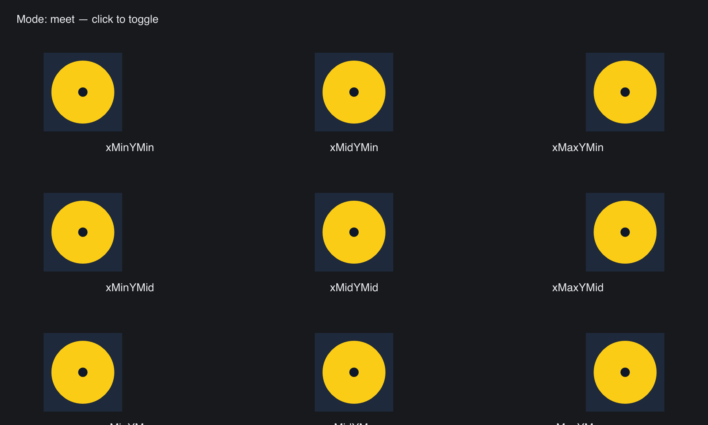

# SVG Aspect

> **Framework:** svg **Description:** preserveAspectRatio meet and slice
> alignment on SVG. Shows slack distribution across alignments.



<!-- explorer: tags=svg category=svg run=go -->

---

# svg_aspect

A 3x3 grid renders the same square SVG inside wide rectangular tiles under each
`preserveAspectRatio` alignment value. A click in the top row toggles between
`meet` (fit, leaves slack) and `slice` (fill, overflows + clips). Demonstrates
that the alignment offset places the content correctly along the under-filled
axis.

## Run

```
go run ./examples/svg_aspect
```
