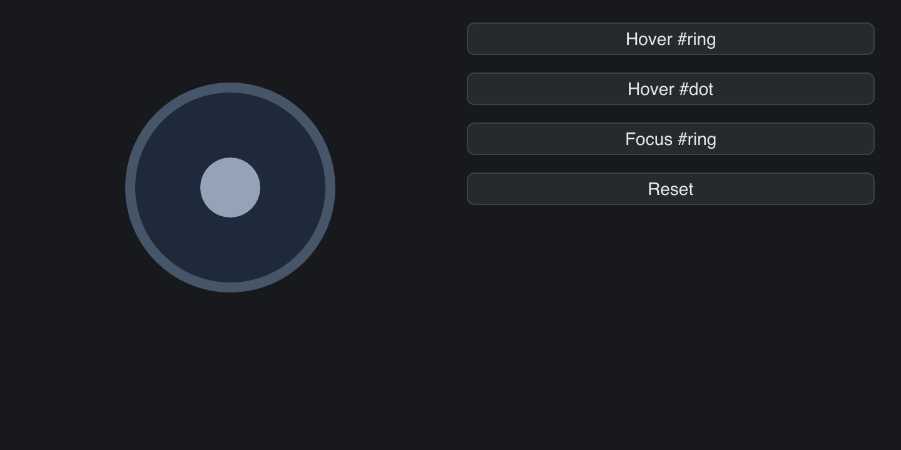

# SVG CSS States

> **Framework:** svg **Description:** :hover and :focus matching on SVG driven
> by HoveredElementID and FocusedElementID.



<!-- explorer: tags=svg category=svg run=go -->

---

# svg_css_states

Demonstrates CSS `:hover` and `:focus` pseudo-class matching driven by
`HoveredElementID` / `FocusedElementID` on `SvgCfg`.

The embedded `<style>` block defines hover/focus rules for two element ids
(`#ring`, `#dot`). Buttons toggle the IDs that the SVG view forwards through
`SvgCfg`. The cascade re-runs, and the widget re-renders with the new colors
applied.

**Status:** v0.15.0 ships the parser/cascade/cache plumbing. The widget does not
yet auto-detect mouse hover — apps drive the IDs themselves. Pointer-tracking
hover for the `Svg` widget is the v0.16 followup.

To wire it manually: hit-test the cached SVG paths via
`TessellatedPath.ContainsPoint(px, py)` (added in v0.13.0). Then recover the
corresponding element id. Then feed it back through `SvgCfg` on the next View
pass.

Run:

```
go run ./examples/svg_css_states/
```
