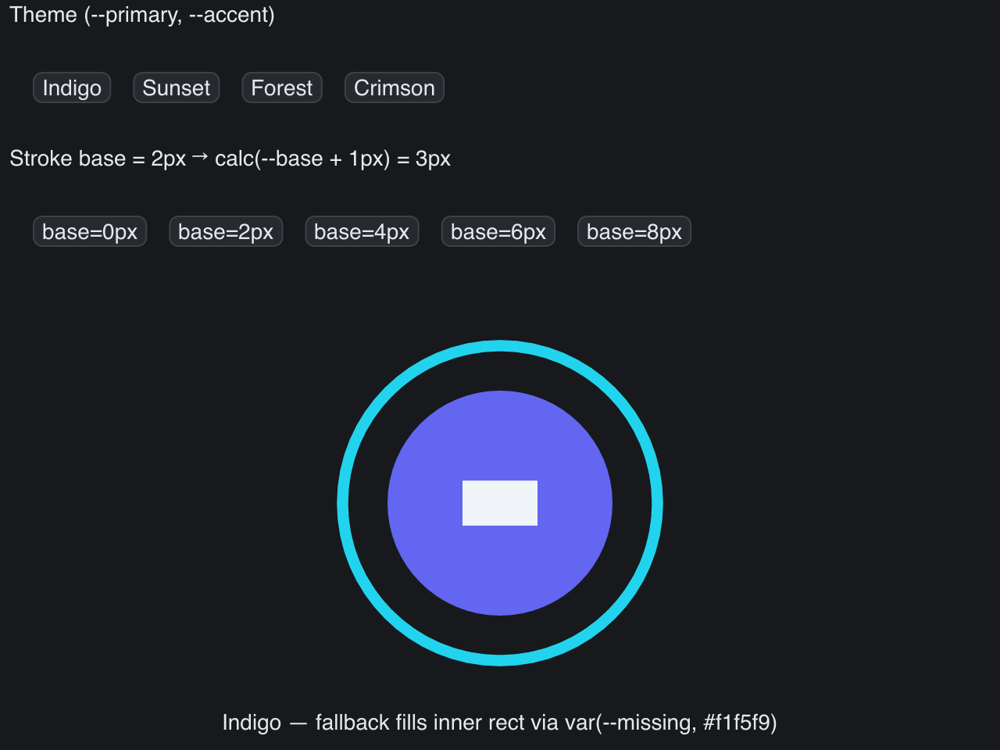

# SVG CSS Vars

> **Framework:** svg, theme **Description:** CSS custom properties with var()
> fallback and calc() arithmetic. Theme switch rebuilds the SVG source.



<!-- explorer: tags=svg,theme category=svg run=go -->

---

# svg_css_vars

Demonstrates v0.14.0 custom-property additions:

- **`var(--name, fallback)`** — the renderer honors the fallback when the named
  variable is undefined. The inner rect's `fill` resolves to the fallback
  `#f1f5f9` because `--missing` is never defined.
- **`calc()`** — `calc(var(--base) + 1px)` computes the stroke width. The base
  value is mixed with a unit-bearing literal and resolves at parse time.
- **Theme switching** — rebuilds the SVG source with a different `--primary` /
  `--accent` per theme. The cascade picks the new values.

## Run

```
go run ./examples/svg_css_vars
```
