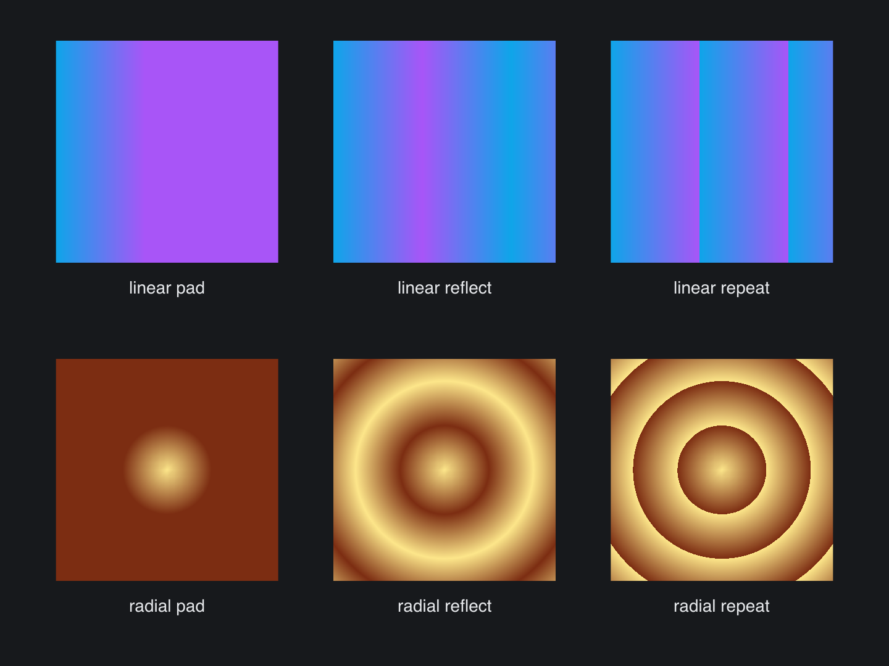

# SVG Gradient Spread

> **Framework:** svg **Description:** spreadMethod pad, reflect, and repeat on
> linear and radial gradients. Compares falloff in a 2x3 grid.



<!-- explorer: tags=svg category=svg run=go -->

---

# svg_gradient_spread

Demonstrates the `spreadMethod` attribute on `<linearGradient>` and
`<radialGradient>`.

For each gradient kind, the app renders the same source three times, once per
spread mode:

- `pad` — values outside [0,1] clamp to the first/last stop. Default.
- `reflect` — triangle wave: the gradient mirrors back and forth.
- `repeat` — sawtooth: the gradient wraps as a tile.

Stops sit on a short segment (`x1=0% x2=40%`). This leaves room outside the
gradient's own range, so reflect and repeat have somewhere to wrap.

Run:

```
go run ./examples/svg_gradient_spread/
```
