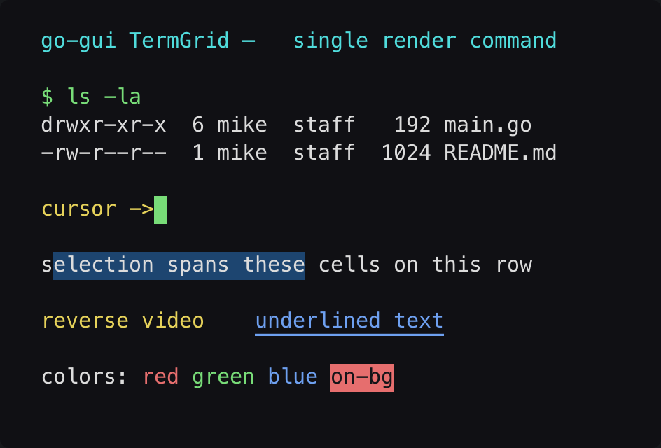

# TermGrid

> **Framework:** text, graphics **Description:** Fixed-pitch character grid from
> a cell buffer. Shows colors, reverse, underline, and block selection.



<!-- explorer: tags=text,graphics category=text run=go -->

---

## Run

```sh
go run ./examples/termgrid/
```

## What it demonstrates

Fixed-pitch character grid from a cell buffer. Shows colors, reverse, underline,
and block selection.

See `main.go` for the implementation.
