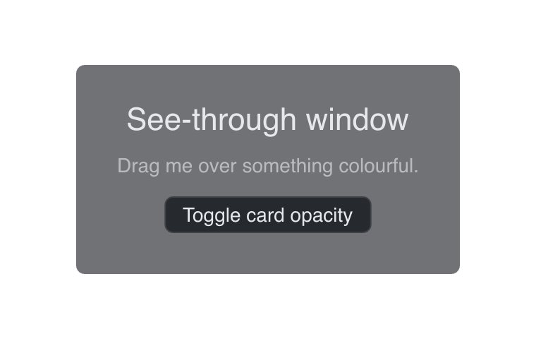

# Transparent

> **Framework:** system, platform **Description:** A see-through window via
> WindowCfg.Transparent, on macOS, Windows and X11.



<!-- explorer: tags=system,platform category=system run=go -->

---

## Run

```sh
go run ./examples/transparent/
```

## What it demonstrates

`WindowCfg.Transparent` lets the window's alpha channel reach the compositor, so
the desktop behind shows through wherever the content is not opaque. The card in
the middle is the only opaque thing in the window; the button changes its alpha,
which shows that the window itself is see-through and not only its edges.

`Transparent` on its own is enough. An unset `BgColor` on a transparent window
is treated as fully clear instead of taking the opaque theme background.

This is plain transparency, with no blur. For the blurred macOS backdrop, see
`examples/vibrancy/` and `Window.SetWindowVibrancy`.

## Platform notes

| Platform          | Behaviour                                             |
| ----------------- | ----------------------------------------------------- |
| macOS             | Non-opaque `NSWindow` and `CAMetalLayer`              |
| Windows           | `DwmEnableBlurBehindWindow` with an empty blur region |
| X11               | Depth-32 ARGB visual; needs a compositing manager     |
| web, iOS, Android | Ignored                                               |

On X11 with no compositing manager running, the window renders black.
`gui.Debug(true)` reports that, and also reports a driver that offered no
depth-32 visual.

See `main.go` for the implementation.
